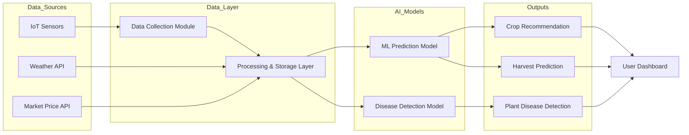

# 🌾 AI-Based Smart Farm Management System

## 📌 Overview
The Smart Farm Management System is an AI-driven platform designed to assist farmers in making data-driven decisions. It integrates IoT sensor data, weather insights, and market analysis to optimize crop selection, harvesting time, and overall farm productivity.

---

## 🚀 Features
- 🌡️ Real-time monitoring of farm conditions (temperature, soil moisture, humidity)
- 🌦️ Weather API integration for historical and forecast-based insights
- 📈 Market price trend analysis for better selling decisions
- 🤖 Machine learning models for crop recommendation & harvest prediction
- 🌿 Computer vision-based plant disease detection
- 📊 Interactive dashboard for decision support

---

## 🏗️ System Architecture

---

## 🛠️ Tech Stack
- Programming Language: Python  
- Machine Learning: Scikit-learn / TensorFlow / Keras  
- Computer Vision: OpenCV, CNN  
- APIs: Weather API, Market Price API  
- Hardware: Raspberry Pi, ESP-32, IoT Sensors (Soil Moisture, Temperature, etc.)  
- Data Processing: Pandas, NumPy  

---

## ⚙️ How It Works
1. Collects real-time farm data using IoT sensors  
2. Fetches weather forecasts and historical trends via APIs  
3. Analyzes crop market price trends  
4. Uses ML models to:
   - Recommend optimal crops  
   - Predict harvesting time  
5. Detects plant diseases using image input  
6. Displays actionable insights via a dashboard  

---

## 🔮 Future Improvements
- 📡 Real-time IoT hardware deployment  
- 🛰️ Satellite data integration (NDVI analysis)  
- 📱 Mobile application for farmers  
- 🤖 AI chatbot for agricultural assistance  
- 🌍 Multi-region adaptive crop prediction models  

---

## 🎥 Demo

---

## 👨‍💻 Author
Sambhav Jain
